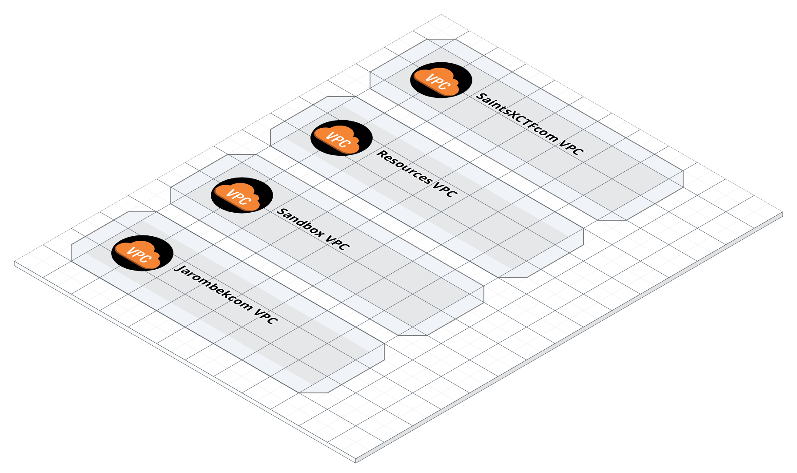

# global-aws-infrastructure

### Overview

This repository contains all the global infrastructure-as-code (IaC) for Andrew Jarombek.  All other IaC
repositories are referenced in separate directories and README.md files.

### Infrastructure Diagram

*Last Updated: Feb 10th, 2019*

### Directories

| Directory Name    | Description                                                                 |
|-------------------|-----------------------------------------------------------------------------|
| `apps`            | Infrastructure for individual applications.                                 |
| `apps-sandabox`   | Infrastructure for prototype applications in the Sandbox VPC.               |
| `backend`         | The Terraform backend, consisting of an S3 bucket.                          |
| `root`            | Root Terraform scripts for creating the accounts VPCs.                      |
| `iam`             | Terraform scripts for creating IAM users, groups, roles, and policies.      |
| `route53`         | Terraform scripts for creating DNS records for the account.                 |
| `jenkins`         | Packer AMI & Terraform scripts for creating a Jenkins server.               |
| `jenkins-efs`     | Terraform scripts for creating an EFS for the Jenkins server.               |
| `s3`              | Terraform scripts for global S3 assets.                                     |

### Version History

**[V.1.0.0](https://github.com/AJarombek/global-aws-infrastructure/tree/v1.0.0) - MVP Release**

> Release Date: May 13th, 2017

This update marks the official release of my global Infrastructure with a full Python unit test suite.

* Jenkins Server
* DNS Records
* VPCs and Subnets
* Terraform Backend
* Global S3 Bucket
* Python Unit Tests